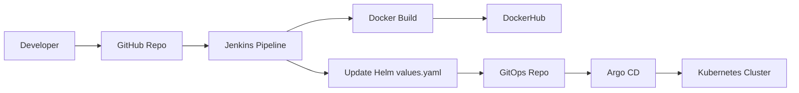
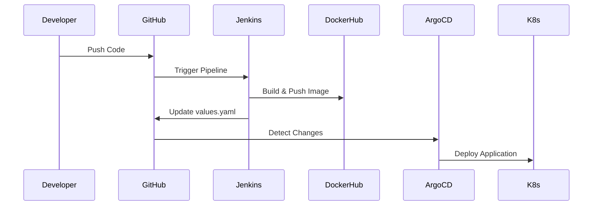

# 🚀 GitOps CI/CD Pipeline using Jenkins, Argo CD, Helm & Kubernetes


\

---

## 📌 Project Overview

This project demonstrates a complete **end-to-end CI/CD pipeline using GitOps principles**.

It automates:

* Build
* Test
* Docker image creation
* Deployment to Kubernetes

---
## 🏗️ Architecture Diagram



---

## 🔄 Workflow Visualization



---

## 🔄 Workflow (Step-by-Step)

### 1️⃣ Code Push

Developer pushes code to GitHub.

---

### 2️⃣ Jenkins Pipeline

* Build Docker image
* Run container for testing
* Perform `/health` check
* Push image to DockerHub
* Update Helm `values.yaml`

---

### 3️⃣ Argo CD Deployment

* Detects Git changes
* Syncs automatically
* Deploys to Kubernetes

---

## 🌐 Accessing the Application

Since the cluster runs on **Kind**, services are exposed using port-forward.

---

### 🔹 Flask Application

```bash
kubectl port-forward -n gitops service/flask-app-service 5000:80 --address 0.0.0.0
```

👉 Open:

```
http://<EC2-IP>:5000
```

---

### 🔹 Argo CD UI

```bash
kubectl port-forward -n argocd service/argocd-server 8443:443 --address 0.0.0.0
```

👉 Open:

```
https://<EC2-IP>:8443
```

---

## 📁 Repository Structure

```
gitops-flask-app/
├── app.py
├── Dockerfile
├── Jenkinsfile
```

```
gitops-flask-app-manifests/
└── flask-app/
    ├── Chart.yaml
    ├── values.yaml
    └── templates/
```

---

## 🧠 Key Features

* ✅ End-to-end CI/CD pipeline
* ✅ Automated testing before deployment
* ✅ GitOps workflow
* ✅ Helm-based configuration
* ✅ Auto deployment using Argo CD

---

## 🎯 Demo Flow

1. Trigger Jenkins build
2. Image built & pushed
3. GitOps repo updated
4. Argo CD syncs
5. App updates (`/version`)

---

## 💬 Interview Explanation

> I implemented a GitOps-based CI/CD pipeline where Jenkins builds and tests the application, updates a Helm chart repository, and Argo CD ensures the Kubernetes cluster state matches the desired configuration in Git.

---

## 👨‍💻 Author

**Gautam Dev**

